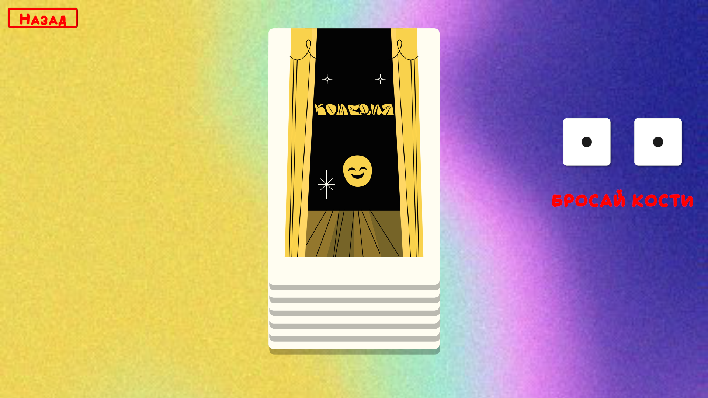
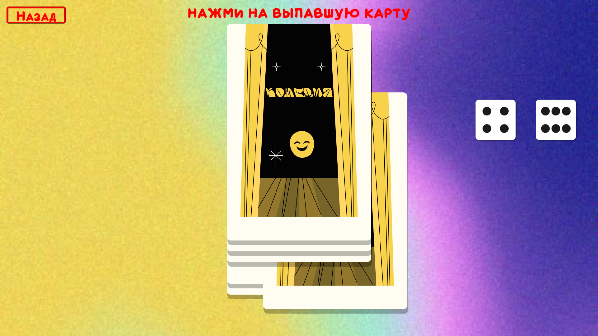
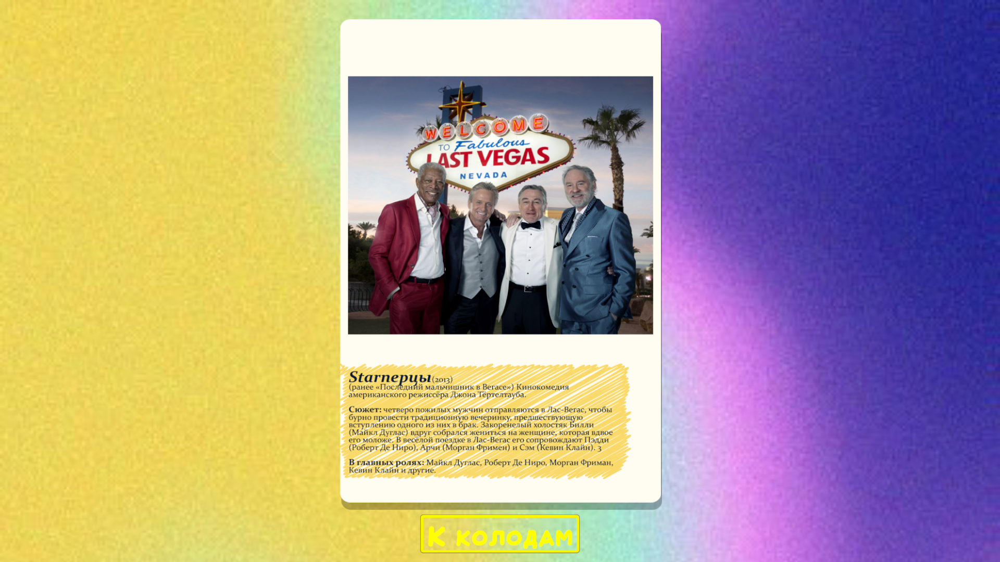

# Movie-Picking Game Solution (Battleship Style)

[Eng](./README.md) | [Rus](./README_RU.md)

* This project is a private commission and is available at the link - <https://exzet.itch.io/choose-film-sea-battle>

## Description

The idea behind the game is a **simplified, randomized card-based experience**, where the player interacts with a deck with minimal actions, rolls dice, and gets a result in the form of a card event. The main focus is on the atmosphere, simplicity, and the thrill of unveiling each card.

### Mechanics

1. **Deck Selection:**
   * The starting screen displays several decks (e.g., themed: "Mystery," "Space," "Fantasy").
   * The player selects one, and the rest disappear.

2. **Dice Roll:**
   * After selecting a deck, a minimalistic screen with dice and a "Restart" button appears.
   * The player rolls the dice, resulting in a number between 2 and 12.

3. **Card Selection:**
   * The roll determines which card from the deck is chosen.
   * The selected card moves forward, drawing the player's attention.

4. **Card Reveal:**
   * The player taps on the selected card to "reveal" it, displaying:
     * Title
     * Image/Illustration (if available)
     * Text (description, mini-story, or event).

5. **Round Completion:**
   * To exit the card view, the player must press the "Restart" button to begin again.

### Features

* Full emphasis on intrigue and randomness.
* The player has minimal actions (choosing, rolling, revealing), making the process as simple as possible.
* Card content can vary — from interesting events to riddles, questions, or jokes.

### Why It Works

* Quick, easy-to-play sessions.
* The excitement of unveiling each new card.
* Great potential for fine-tuning deck themes and game atmosphere.

This works perfectly as a mobile time-killer or as a hybrid between a fortune-telling mechanic and a mini-game.

### Developer

* Kirill Shutov (ShutovKS), Russia

## Screenshots

  
  
  
  
