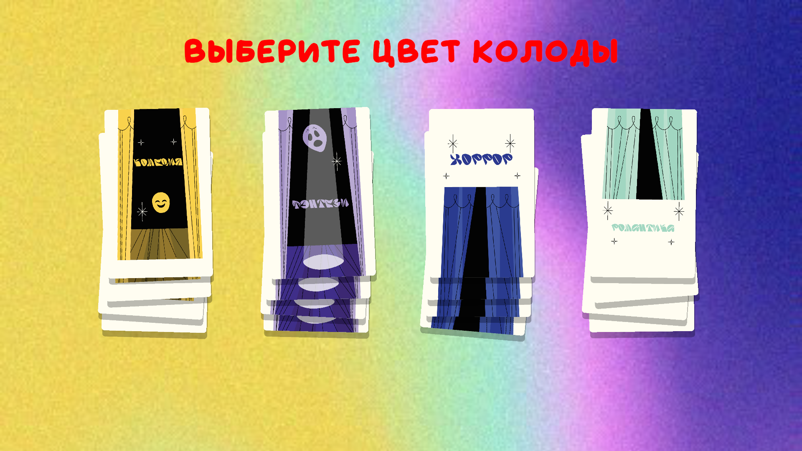

# Игровое решение для выбора фильма (Морской бой)

[Eng](./README.md) | [Rus](./README_RU.md)

* Этот проект является частным заказом и доступен по ссылке - <https://exzet.itch.io/choose-film-sea-battle>.

## Описание

Идея игры — **упрощённый рандомизированный карточный опыт**, где игрок минимальными действиями взаимодействует с колодой, бросает кубики и получает результат в виде карточного события. Основной акцент — на атмосферу, простоту и чувство интриги при открытии карты.

### Механика

1. **Выбор колоды:**
   * Стартовая сцена показывает несколько колод (например, тематических: "Мистика", "Космос", "Фэнтези").
   * Игрок выбирает одну, остальные исчезают.

2. **Бросок кубиков:**
   * После выбора появляется минималистичный экран с кубиками и кнопкой "Рестарт".
   * Игрок бросает кубики, выпадает число от 2 до 12.

3. **Выбор карты:**
   * Результат броска выбирает одну из карт из колоды.
   * Карта двигается вперёд, привлекая внимание игрока.

4. **Открытие карты:**
   * Игрок тапает на выбранную карту, и она "открывается", показывая:
     * Заголовок
     * Изображение/иллюстрацию (если есть)
     * Текст (описание, мини-история или событие).

5. **Завершение раунда:**
   * Из режима просмотра карты можно выйти только кнопкой "Рестарт", чтобы начать всё заново.

### Особенности

* Полный упор на интригу и рандом.
* Игроку доступен минимум действий (выбор, бросок, открытие карты), что делает процесс максимально простым.
* Карточное содержимое может быть любой — от интересных событий до загадок, вопросов или шуток.

### В чём кайф

* Быстрые, лёгкие сессии.
* Интерес при открытии каждой новой карты.
* Потенциал для тонкой кастомизации колод и атмосферы игры.

Это отлично работает как мобильный таймкиллер или как что-то на стыке гадательной механики и мини-игры.

### Разработчик

* Кирилл Шутов (ShutovKS), Россия

## Скриншоты

